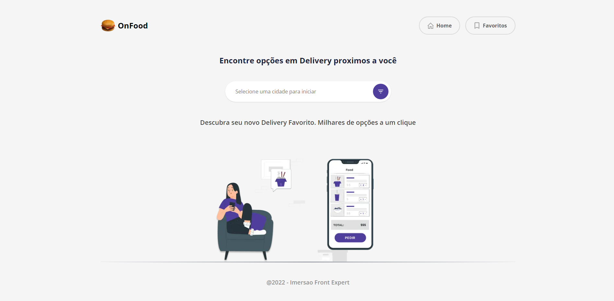
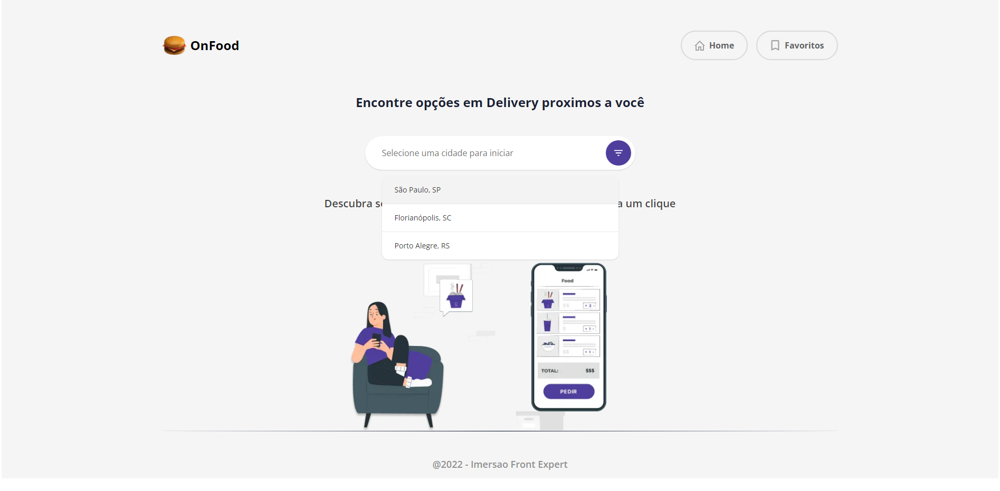
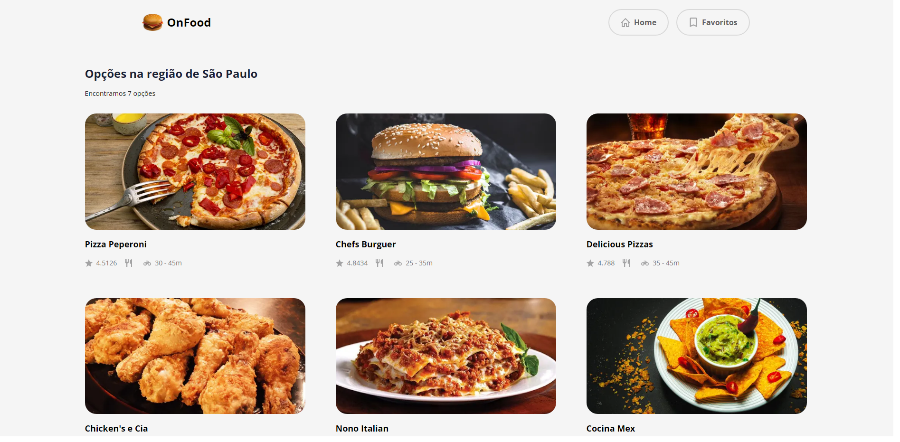

# On Food Delivery

# Sobre o projeto

Aplicação de delivery desenvolvida na imersão FrontExpert que um usuário escolhe uma cidade e recebe todas as opções cadastradas no sistema. 

## Imagens da aplicação

### inicio



### pesquisa



### resultados



# 🚀 Começando

Essas instruções permitirão que você obtenha uma cópia do projeto em operação na sua máquina local para fins de desenvolvimento e teste.

## 📋 Pré-requisitos

- npm / yarn

## 🔧 Instalação
### :warning::warning: **A pasta frontexpert-imgs**: é para guardar as imagens usadas no readme.md! Apagar ela depois do clone :warning::warning:
``` bash
## clonar repositório
git clone https://github.com/PauloCSantos/onfood-frontexpert.git

## entrar na pasta do projeto
cd frontexpert

## instalar as dependencias
npm install

## executar o projeto
npm run dev
```

## 🛠️ Construído com

- NextJS  
- TypeScript
- TailWindCSS 
- HeadLessUI
- axios

## ✒️ Autor

* **Paulo C Santos** - [Linkedin](https://www.linkedin.com/in/paulocsantos1995/)

## 🖐️ Agradecimento

Agradeço ao Daniel Castro pela Imersão FrontExpert

-Link do canal do Daniel: https://www.youtube.com/c/odanieldcs
